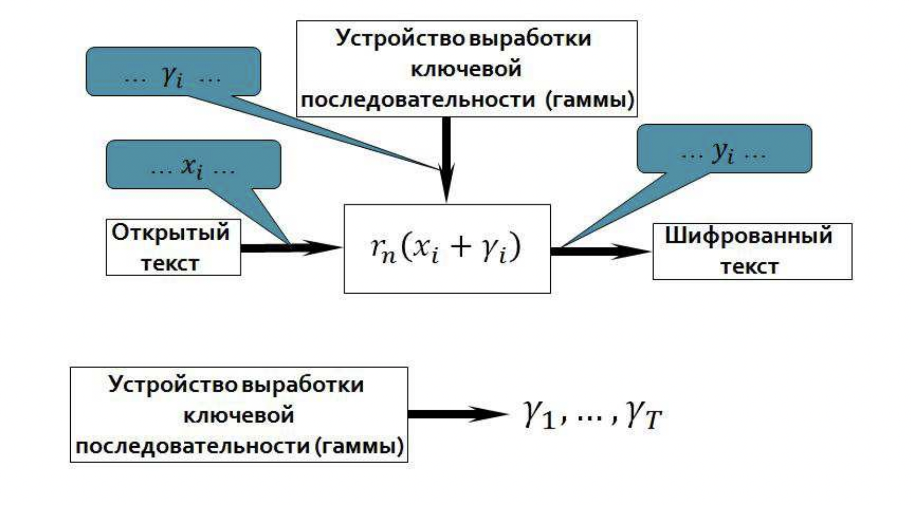
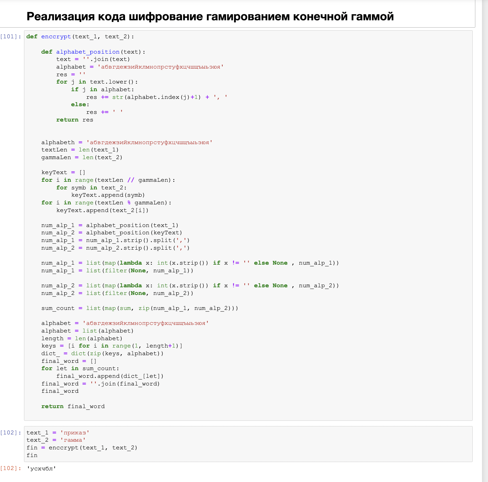

# Лабораторная № 3
# Шифр гаммированием
# Баранов Иван Юрьевич

ЦЕЛЬ РАБОТЫ

-  Ознакомиться с шифрами гаммирования;
-  Реализовать шифр гаммированием конечной гаммы при помощи языка программирования PYTHON;

Ход работы 

•	Для реализации алгоритмов использовались средства языка
•	Python.
•	Были реализованы шифраторы, рассматриваемых алгоритмов. 

# Описание сущности шифра перестановки

**•	Гамми́рование (gamma xoring) — метод шифрования, основанный на «наложении» гамма-последовательности на открытый текст. Обычно это суммирование в каком-либо конечном поле (например, в поле GF(2) такое суммирование принимает вид обычного «исключающего ИЛИ»). При расшифровании операция проводится повторно, в результате получается открытый текст.**

 
# Описание реализации
# 1 задача шифр гаммированием конечной гаммы

Вывод

•	Ознакомились с шифрами гаммирования;
•	Реализовали шифр гаммированием конечной гаммы.
